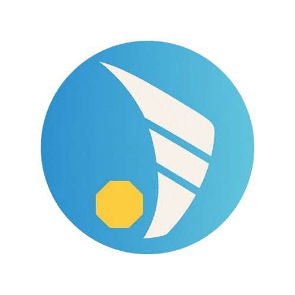
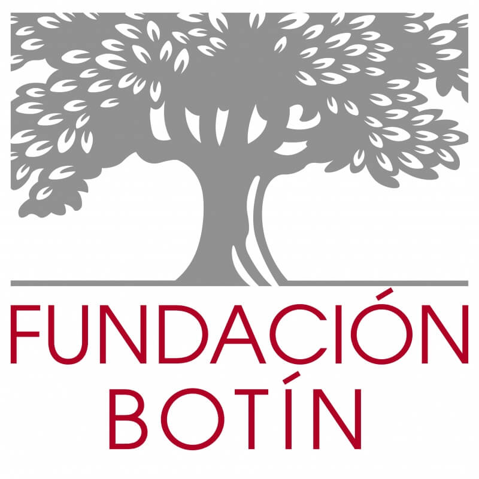

<!--<!DOCTYPE html>-->
<html lang="es">
<head>
    <meta charset="UTF-8">
    <meta name="viewport" content="width=device-width, initial-scale=1.0">
    <title>Activá lo Público</title>
    <!-- Fuentes modernas: Poppins para dar un look limpio, juvenil y profesional -->
    <link rel="preconnect" href="https://fonts.googleapis.com">
    <link rel="preconnect" href="https://fonts.gstatic.com" crossorigin>
    <link href="https://fonts.googleapis.com/css2?family=Poppins:wght@300;400;600;700&display=swap" rel="stylesheet">
    
</head>
<body>

    <header>
        

            
            
        

        <h1 class="fade-in" style="animation-delay: 0.3s;">Activá lo Público</h1>
        
El programa para enamorar a las juventudes de lo público.

        <a href="#fechas" class="btn-header fade-in" style="animation-delay: 0.7s;">#SeActiva</a>
        
        <!-- Curva Decorativa -->
        

            <svg data-name="Layer 1" xmlns="http://www.w3.org/2000/svg" viewBox="0 0 1200 120" preserveAspectRatio="none">
                <path d="M321.39,56.44c58-10.79,114.16-30.13,172-41.86,82.39-16.72,168.19-17.73,250.45-.39C823.78,31,906.67,72,985.66,92.83c70.05,18.48,146.53,26.09,214.34,3V0H0V27.35A600.21,600.21,0,0,0,321.39,56.44Z" class="shape-fill"></path>
            </svg>
        

    </header>

    <section>
        <!-- Misión destacada sobrepuesta -->
        

            <h3>Nuestra Misión</h3>
            
"Que más de las y los mejores se enamoren de lo público"

        

        <h2>¿Quiénes Somos?</h2>
        

            
<strong>Actio</strong> es una asociación civil formada por personas comprometidas con la función pública en Argentina, fundada en 2020 por ex becarios del Programa para el Fortalecimiento de la Función Pública en América Latina de la Fundación Botín. Actualmente reúne a 74 miembros.

             
            
Nuestro principal aliado es la <strong>Fundación Botín</strong>, creada en 1964, que actúa en toda España y América Latina con la misión de contribuir al desarrollo integral de la sociedad.

        

        <h2>El Programa</h2>
        

            
Buscamos llegar a jóvenes de Argentina a través de una experiencia federal y latinoamericanista, con un componente vivencial y otro formativo, que contribuya a entender, involucrarse y defender el valor de lo público.

        

        
        <ul class="grid-cards">
            <li class="card-item">
                <strong class="text-highlight">Etapa Virtual</strong>  
                Participan 50 jóvenes de todas las provincias argentinas. Incluye clases magistrales semanales, conversaciones, talleres de simulación y encuentros virtuales con referentes de Argentina y Latinoamérica.
            </li>
            <li class="card-item">
                <strong class="text-highlight">Etapa Presencial</strong>  
                Se seleccionarán 25 participantes con base en su desempeño. Se realizará en Córdoba, en el camping de AGEC (Santa Ana).  
                <em>Ejes: Actividad vivencial, charlas con líderes y networking.</em>
            </li>
        </ul>

        <h2 style="margin-top: 4rem;">Criterios de Selección</h2>
        
El programa está dirigido a jóvenes de Argentina de 18 a 21 años que hayan finalizado el colegio secundario y estén cursando estudios universitarios o terciarios.

        
        <ul class="grid-cards">
            <li class="card-item">Poseer nacionalidad argentina.</li>
            <li class="card-item">Haber nacido entre el 14 de Julio de 2004 y el 13 de Julio de 2008 inclusive.</li>
            <li class="card-item">Haber finalizado el secundario, ser estudiante de grado/terciario y no haber superado el 50% de la carrera.</li>
            <li class="card-item">Contar con buen expediente académico y compromiso social.</li>
            <li class="card-item">Vocación de servicio e interés por ser agente de cambio.</li>
        </ul>

        <!-- LÍNEA DE TIEMPO MODERNIZADA -->
        <h2 id="fechas" style="margin-top: 5rem;">Fechas Clave</h2>
        
        

            

                

                    27 de Abril
                    
Lanzamiento y apertura de postulaciones.

                

            

            
            

                

                    29 de Mayo
                    
Cierre del período de postulaciones.

                

            

            
            

                

                    Hasta el 24 de Junio
                    
Período de evaluación de postulaciones.

                

            

            
            

                

                    Hasta el 1 de Julio
                    
Etapa de entrevistas.

                

            

            
            

                

                    5 de Julio
                    
Inicio de la etapa virtual.

                

            

            
            

                

                    22 de Julio
                    
Anuncio de seleccionados y seleccionadas.

                

            

            
            

                

                    9 de Septiembre
                    
Fin de la etapa virtual.

                

            

            
            

                

                    14 de Septiembre
                    
Anuncio de seleccionados/as para la etapa presencial.

                

            

            
            

                

                    2, 3 y 4 de Octubre
                    
Etapa presencial (Córdoba).

                

            

        

        <a href="https://docs.google.com/forms/d/e/1FAIpQLSc8UXKnP1Wgiz1MV9g4C8mYZVBhqbL7IvHLtiNJA6kRepQPYQ/viewform?usp=dialog" target="_blank" class="postulate-btn">Postulate Aquí</a>
    </section>

    <footer>
        

            

                <h4>Contacto</h4>
                
redactioargentina@gmail.com

            

            

                <h4>Redes Sociales</h4>
                
Instagram: @red.actio

            

        

        

            
© 2026 Activá lo Público. Desarrollado por la Asociación Civil Actio.

        

    </footer>

</body>
</html>
